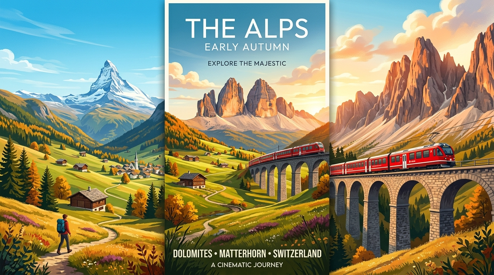
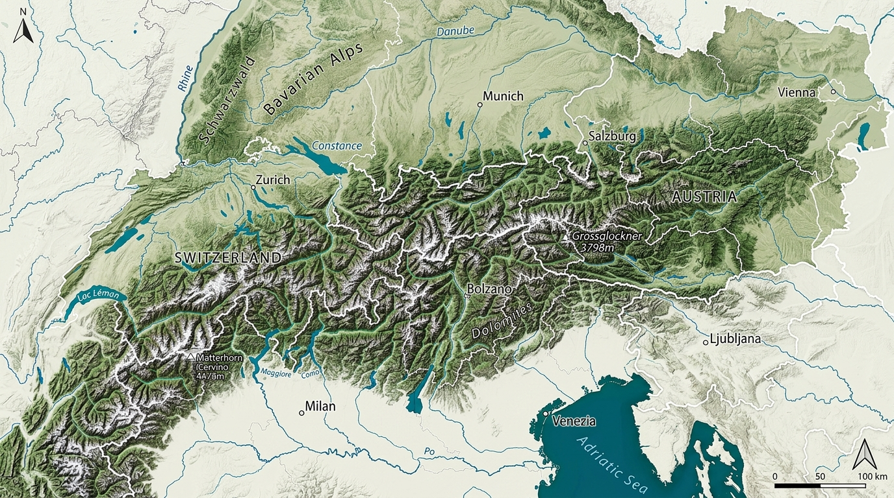

# Europe Alpine Odyssey: Bavaria, Austria, Dolomites, Venice & Switzerland
### Comprehensive 16-Day Expedition Plan | September 4 – 19, 2026
**The Travel Party (4 Adventurers):** Built for Bill & Kris Rowe and Mark & Shelly Matthews  
**Primary Hubs:** Munich • Salzburg • Innsbruck • Alta Badia (Dolomites) • Venice • Tirano • Zermatt • Geneva

---

---

## 👥 The Travel Party (All 16 Days)

* **Bill & Kris Rowe:** Trip Curators & Co-Planners (spearheading the itinerary design; traveling together across all 16 days from MSP departure through MSP return).
* **Mark & Shelly Matthews:** Co-Planners & Travelers (Delta Outbound Conf: `GYXLN6`, Aer Lingus Return Ref: `2AXKMS`, Hotels.com bookings).
* **Party of 4 Logistics:**
  * **Flights:** Traveling together on DL 164 (MSP ➔ AMS), DL 9553 (AMS ➔ MUC), EI 0681 (GVA ➔ DUB), and EI 0089 (DUB ➔ MSP).
  * **Accommodations:** 2 rooms booked/reserved at each property (Boutique Hotel Germania, June Six Salzburg, NALA Innsbruck, and Hotel Rezia in La Villa).
  * **Vehicle Rental (Bolzano ➔ Venice):** Sized for 4 adults plus 4 large pieces of luggage (Full-size SUV such as Audi Q7 / BMW X5, or Mercedes V-Class / minivan).
  * **Excursions & Dining:** Neuschwanstein Castle tour (4 seats • $227 ea), cable car ascents, and dinner reservations in La Villa and Ortisei set for a table of four.
  * **Upcoming Planning Review:** Dolomites vehicle & Switzerland details (Tirano, Zermatt, Geneva) undergoing review with travel planner **Madeline** on Monday evening, August 31.
  * **🎟️ Tickets & Supporting Docs Hub (39 Files):** All official PDF/PNG documents are cataloged under [`documents/`](documents/) with multi-facet mobile filtering and offline caching in the web app.

---

## 📋 Master Confirmation & Booking Directory

| Date Range | Booking Type | Provider / Property | Confirmation / Voucher | Notes / Contact |
| :--- | :--- | :--- | :--- | :--- |
| **09/04 – 09/05** | **Outbound Flights** | **Delta / KLM** | `GYXLN6` (Matthews) | DL 164 (MSP 9:45 PM ➔ AMS) + DL 9553 (AMS ➔ MUC 5:00 PM) • Party of 4 |
| **09/05 – 09/08** (3 Nights) | Hotel (Munich) | **Boutique Hotel Germania** | Hotels.com `#72076955244782` | Schwanthalerstraße 28, Munich • +49 89 590460 • 2 Rooms (Matthews & Rowe) |
| **09/07** | Day Tour | **Neuschwanstein Castle** | Bus Tour ($227 ea) | Full-day excursion from Munich to Bavarian royal castles (4 seats) |
| **09/08 – 09/10** (2 Nights) | Hotel (Salzburg) | **June Six Salzburg** | Hotels.com `#72077000025128` | Haunspergstraße 41, Salzburg • +43 662 254156 • 2 Rooms (Matthews & Rowe) |
| **09/10** | High-Speed Rail | **WESTbahn: Salzburg ➔ Innsbruck** | Omio `#336-9587-7889` | 9:39 AM – 11:58 AM (Salzburg Hbf ➔ Innsbruck Hbf) • Booked by Kris |
| **09/10 – 09/11** (1 Night) | Hotel (Innsbruck) | **NALA individuellhotel** | Hotels.com `#72076999785742` | Müllerstrasse 15, Innsbruck • +43 512 584444 • 2 Rooms (Matthews & Rowe) |
| **09/10** | Show & Dinner | **Tyrolean Folk Show** | Alpensaal Innsbruck | 8:30 PM Show + Traditional Dinner + 1 drink • Booked by Shelly |
| **09/11** | Scenic Rail | **ÖBB Railjet 81 (Innsbruck ➔ Bolzano)** | ÖBB Confirmed | 9:24 AM – 11:27 AM • 1st Class, Coach 261, Seats 111, 116, 113, 115 (Quiet Zone) |
| **09/11 – 09/14** (3 Days) | Rental Car | **Auto Europe / Europcar** | AE `#745646711` • EC `#1206017591` | Bolzano Airport pick-up (12 PM) ➔ Venice Piazzale Roma drop (12 PM) • Peugeot 508 SW SWAR Diesel Auto • Driver: William Rowe |
| **09/11 – 09/14** (3 Nights) | Hotel (Dolomites) | **Hotel Pension Rezia** | Booking `#R3653` | Str Cianins 3 / Str. Colz 64, La Villa in Badia • 2 x Mansard Rooms • Pre-check-in done |
| **09/14 & 09/16** | Private Water Taxis | **VLS Agency (Venice)** | VLS Dispatch (+39 345 1879941) | Sep 14: 3 Ponti ➔ S. Angelo (€120 prepaid) • Sep 16 @ 6:30 AM: S. Angelo ➔ Station (€140 prepaid) |
| **09/14 & 09/15** | Private Guided Tours | **Maria Andrea (Venice Guide)** | Cell: +39 388 642 0499 | Sep 14 (4–7 PM): Intro Tour (€270 prepaid) • Sep 15 (10 AM–1 PM): Doge's & St. Mark's (€510 prepaid incl tickets) |
| **09/14 – 09/16** (2 Nights) | Hotel (Venice) | **B&B Fortuny** | Ref: `TY78554084-1` | San Marco, Corte Lucatello 3484 • Canal View (Matthews) & Courtyard View (Rowe) |
| **09/16** | High-Speed Rail | **Frecciarossa 9713 (Mestre ➔ Milan)** | `J7Z9R5` (M) • `J6V3Z5` (R) | 8:00 AM – 10:15 AM • Coach 3 Business, Seats 15A/B, 16A/B |
| **09/16** | Scenic Rail | **Bernina RE 1660 (Tirano ➔ St. Moritz)** | SBB / RhB Confirmed | 3:00 PM – 5:11 PM • 1st Class, Coach 3, Seats 11, 12, 21, 22 |
| **09/16 – 09/17** (1 Night) | Hotel (St. Moritz) | **Hotel Arte St. Moritz** | `2026080150736583` (M) • `2026080150736489` (R) | Via Tinus 7 / Somplatz • 2 x Double Balcony Rooms • Dining: *La Stalla* |
| **09/17 – 09/18** (1 Night) | Hotel (Zermatt) | **Beau-Rivage Hotel Garni** | `60682436` (M) • `60682402` (R) | Kirchstrasse 44, Zermatt • Double Standard (M) & Double Queen (R) Valley View |
| **09/18 – 09/19** (1 Night) | Hotel (Geneva) | **The New Midi Geneva** | `1091654581` (M) • `1091652434` (R) | Place de Chevelu 4, Quai de Bergues • 2 x Superior Room River View |
| **09/19** | **Return Flights** | **Aer Lingus** | `2AXKMS` (Matthews) | 7:00 AM taxi to GVA + EI 0681 (GVA 10:10 AM ➔ DUB) + EI 0089 (DUB ➔ MSP 5:00 PM) |

### 📱 Dedicated On-Trip Support & Emergency Contacts
- **Primary On-Trip Support:** Rebecca (Italy Beyond the Obvious) • WhatsApp: [`+39 331 222 2349`](https://wa.me/393312222349) • *9:00 AM – 7:00 PM Italian time*
- **Backup Support:** Madeline Jhawar • Call/WhatsApp: [`+1 773 621 3024`](https://wa.me/17736213024) • *5:00 PM – 9:00 AM Italian time*
- **Venice Private Guide:** Maria Andrea • Cell: [`+39 388 642 0499`](tel:+393886420499)
- **Venice Water Taxi Dispatch:** VLS Agency • Call [`+39 345 1879941`](tel:+393451879941) (call 15 mins before scheduled transfers)
- **Universal European Emergency:** 112 (Ambulance Italy: 118 • Ambulance Switzerland: 144 • Rega Air Rescue: 1414)

---

## 🗺️ Journey Flowchart

```mermaid
flowchart TD
    A["🇺🇸 MSP Departure (Party of 4)<br/>Fri Sep 4 (DL 164)"] --> B["🇳🇱 Amsterdam Layover<br/>Sat Sep 5 (2h 35m)"]
    B --> C["🇩🇪 Munich (3 Nights)<br/>Hotel Germania<br/>Sep 5-8 • Old Town & Castles"]
    C --> D["🇦🇹 Salzburg (2 Nights)<br/>June Six Hotel<br/>Sep 8-10 • Fortress & Lakes"]
    D --> E["🇦🇹 Innsbruck (1 Night)<br/>NALA Hotel<br/>Sep 10-11 • Old Town & Tyrol Show"]
    E --> F["🇮🇹 Bolzano ➔ Dolomites (3 Nights)<br/>Car Pickup for 4 ➔ Hotel Rezia<br/>Sep 11-14 • Cable Cars & Hikes"]
    F --> G["🇮🇹 Venice (2 Nights)<br/>Car Return ➔ Fortuny B&B<br/>Sep 14-16 • Canals & San Marco"]
    G --> H["🇮🇹 Water Taxi & Rail to Tirano<br/>Wed Sep 16 • Dep 7 AM / Arr 1:52 PM"]
    H --> I["🇨🇭 Bernina Scenic Railway<br/>Wed Sep 16 • UNESCO Line to St. Moritz<br/>Hotel Arte (1 Night)"]
    I --> J["🇨🇭 Glacier Express Route (Regional Rail)<br/>Thu Sep 17 • St. Moritz ➔ Chur ➔ Andermatt ➔ Zermatt<br/>Hotel Beau Rivage (1 Night)"]
    J --> K["🇨🇭 Matterhorn Glacier Paradise (3,883m) ➔ Geneva<br/>Fri Sep 18 • Cable Cars & Ice Palace ➔ Train to Geneva<br/>Hotel New Midi (1 Night)"]
    K --> L["🇮🇪 6:58 AM Train to GVA ➔ Dublin Layover<br/>Sat Sep 19 (US Preclearance)"]
    L --> M["🇺🇸 MSP Arrival<br/>Sat Sep 19 @ 5:00 PM CDT"]

    classDef flight fill:#e0f2fe,stroke:#0284c7,stroke-width:2px,color:#0369a1;
    classDef stay fill:#f0fdf4,stroke:#16a34a,stroke-width:2px,color:#15803d;
    classDef transit fill:#fef3c7,stroke:#d97706,stroke-width:2px,color:#b45309;

    class A,B,L,M flight;
    class C,D,E,F,G,I,J,K stay;
    class H transit;
```

---

## 🏔️ Topographical Satellite Relief Map

---

## 🗓️ Detailed Day-by-Day Expedition Itinerary

### Leg 1: Bavaria & Royal Castles (Munich)

#### Day 1 — Friday, September 4: Transatlantic Departure (Minneapolis)
- **Flight:** Delta Air Lines **DL 164**
  - **Departure:** Minneapolis-St. Paul (MSP) @ 9:45 PM
  - **Confirmation:** `GYXLN6` (Matthews)
  - **Destination:** Amsterdam Schiphol (AMS)
  - **Passengers:** Mark & Shelly Matthews, Bill & Kris Rowe.

---

#### Day 2 — Saturday, September 5: Welcome to Munich & Transfeero Transfer
- **1:00 PM:** Arrive at Amsterdam Schiphol (AMS). 2h 35m transit window to clear Schengen immigration together.
- **3:35 PM – 5:00 PM:** Flight **DL 9553** (operated by KLM Cityhopper) to Munich (MUC). Touchdown at 5:00 PM.
- **Airport Transfer:** **Transfeero Private Airport Transfer** booked for the party (Ref: `#78653078`). Private driver pickup at MUC Airport directly to Boutique Hotel Germania.
- **Accommodation Check-in:** **Boutique Hotel Germania**
  - *Address:* Schwanthalerstraße 28, 80336 Munich (3-minute walk from Hauptbahnhof).
  - *Booking:* Hotels.com `#72076955244782` | Tel: `+49 89 590460`
  - *Rooms:* 2 Deluxe Double Rooms (3 nights: Sep 5 – 8).
- **Euro Cash Recommendation (Deutsche Bank Filiale):**
  > [!TIP]
  > **Official Bank ATM (1-Min Walk):** Walk out of Hotel Germania, turn right, and walk 40 meters (just 2 doors down to **Deutsche Bank Filiale**, Schwanthalerstraße 32). It features a 24/7 self-service indoor lobby with secure ATMs. Withdrawing €100–€200 cash with a USAA debit card incurs **$0.00 German bank surcharge** and only a 1% USAA foreign transaction fee (~$1.65 on €150). **Crucial rule:** Always choose *"Without Conversion / Settle in EUR"* to decline Dynamic Currency Conversion (DCC) and get the true mid-market rate. Never use standalone Euronet kiosks!
- **Evening:** Unpack, refresh, and enjoy a celebratory Bavarian welcome dinner for four at nearby *Augustiner-Keller* or *Schneider Bräuhaus*.

---

#### Day 3 — Sunday, September 6: Munich Old Town & Bavarian Culture
- **Morning:** Stroll through **Marienplatz** to watch the historic **Glockenspiel** chime and dance (11:00 AM / 12:00 PM). Visit the iconic twin onion towers of **Frauenkirche** and explore the vibrant open-air **Viktualienmarkt**.
- **Afternoon:** Walk along the regal Residenz and into the vast **Englischer Garten (English Garden)**. Watch the famous river surfers on the standing wave at the **Eisbachwelle**.
- **Late Afternoon:** Relax under the chestnut trees at the **Chinesischer Turm (Chinese Tower)** beer garden at a communal table for four.

---

#### Day 4 — Monday, September 7: Fairytale Castles Excursion (Neuschwanstein)
- **Activity:** Full-day Neuschwanstein Castle Bus Tour (4 seats • $227 per person).
- **Highlights:**
  - Scenic luxury coach ride through rolling Bavarian foothills and alpine lakes.
  - Guided tour of King Ludwig II's romantic masterpiece: **Neuschwanstein Castle**.
  - Walk across the breathtaking **Marienbrücke (Mary's Bridge)** suspended high over the dramatic Pöllat Gorge for iconic panoramic group photos.
- **Evening:** Return to Munich. Dinner in the museum quarter or near Karlsplatz. Final night in Munich at Boutique Hotel Germania.

---

### Leg 2: The Austrian Alps (Salzburg & Innsbruck)

#### Day 5 — Tuesday, September 8: Munich to Salzburg
- **By 11:00 AM:** Check out of Boutique Hotel Germania.
- **Train Transit:** Frequent direct EuroCity / Railjet trains from Munich Hbf to Salzburg Hbf (~1 hr 30 mins).
- **Accommodation Check-in:** **June Six Salzburg, Tribute Portfolio**
  - *Address:* Haunspergstraße 41, 5020 Salzburg, Austria.
  - *Booking:* Hotels.com `#72077000025128` | Tel: `+43 662 254156`
  - *Rooms:* 2 Deluxe Rooms (2 nights: Sep 8 – 10). Check-in from 3:00 PM.
- **Afternoon & Evening:** Cross the footbridge into the pedestrian Old Town (*Altstadt*). Walk along picturesque *Getreidegasse* past Mozart’s Birthplace. Dinner for four at *St. Peter Stiftskulinarium* or the lively monks' beer hall at *Augustiner Bräustübl*.

---

#### Day 6 — Wednesday, September 9: Salzburg: Fortress & Mirabell Palace
- **Morning:** Ride the funicular up to the 900-year-old **Hohensalzburg Fortress** for sweeping 360° vistas of the city spires and the jagged Salzkammergut Alps.
- **Afternoon:** Stroll through the lush floral parterres and marble Pegasus fountain of **Mirabell Palace & Gardens** (featured in *The Sound of Music*).
- **Optional:** Afternoon coffee with authentic *Sachertorte* or *Salzburger Nockerl* (sweet soufflé) at Café Tomaselli.

---

#### Day 7 — Thursday, September 10: Salzburg to Innsbruck (Capital of Tyrol)
- **By 12:00 PM:** Check out of June Six Salzburg.
- **Train Transit:** Railjet train from Salzburg Hbf to Innsbruck Hbf (~1 hr 50 mins through the alpine river valleys).
- **Accommodation Check-in:** **NALA individuellhotel**
  - *Address:* Müllerstrasse 15, Innsbruck, Tirol, 6020 Austria.
  - *Booking:* Hotels.com `#72076999785742` | Tel: `+43 512 584444`
  - *Rooms:* 2 Double Rooms (1 night: Sep 10 – 11). Check-in from 3:00 PM.
- **Afternoon:** Walk through Innsbruck's medieval Altstadt to marvel at the **Goldenes Dachl (Golden Roof)** with its 2,657 fire-gilded copper tiles. Ride the futuristic Zaha Hadid designed **Hungerburgbahn** for views over the Nordkette mountains.

---

### Leg 3: Italian Dolomites (Alta Badia & Val Gardena)

#### Day 8 — Friday, September 11: Innsbruck ➔ Bolzano ➔ Ortisei Lunch ➔ La Villa & Piz La Ila
- **9:24 AM – 11:27 AM:** ÖBB Railjet **RJ 81** from Innsbruck Hbf to **Bolzano / Bozen** (1st Class, Coach 261, Seats 111, 116, 113, 115 in Quiet Zone).
- **11:30 AM – 1:00 PM Car Rental Pickup:**
  - Take taxi from Bolzano station to **Europcar Bolzano Airport** (Via Francesco Baracca 1).
  - Pick up rental car: **Peugeot 508 SW SWAR Diesel Automatic** (Auto Europe Voucher `#745646711` • Europcar Conf `#1206017591`). William Rowe primary driver. Zero deductible.
- **1:15 PM Lunch Stop:** **Ristorante Tubladel** in Ortisei (Via Christian Trebinger 22, Val Gardena • `+39 0471 796879`).
- **3:00 PM Accommodation Check-in:** **Hotel Pension Rezia** (Str Cianins 3 / Str. Colz 64, La Villa in Badia • `+39 0471 847155`). 2 x Mansard Rooms (Res `#R3653`, pre-check-in completed). Sauna open 4:00 – 7:00 PM.
- **Afternoon Cable Car:** **Piz La Ila cable car** up to Active Park plateau (€21.90 pp round trip). Stop at La Villa tourist office for hiking maps.
  > [!WARNING]
  > **Cable Car Schedule:** Piz La Ila cable car closes at **5:30 PM**; **final descent is at 5:00 PM sharp**.
- **7:30 PM Dinner:** **Ristorante Mumant à la carte** (Str. Plan 11, San Cassiano • `+39 0471 849544`, 6-min drive). Overnight Hotel Rezia (Night 1).

---

#### Day 9 — Saturday, September 12: Corvara, Boé Gondola & Vallon Lift, Trail 638 to Lago Boé
- **Morning:** 10-minute drive from La Villa to **Corvara**. Park at Boé Gondola (€8/12 hrs).
- **Ascent:** Take **Boé Gondola** + **Vallon Chairlift** (€31.80 pp round trip) up to the lunar amphitheater beneath Piz Boé.
- **Alpine Hike & Lunch:**
  - Easy downhill hike on Trail 638 (~90 minutes) toward emerald-green **Boé Lake (Lech de Boé)**.
  - Relaxed alpine lunch with panoramic views at **Piz Boé Alpine Lounge** (`+39 0471 188 8166`).
- **Descent Timing:**
  > [!IMPORTANT]
  > Boé lift closes at **6:00 PM**; the **final descent is at 5:30 PM sharp**.
- **Late Afternoon:** Drive back to Hotel Rezia. Finnish sauna, vitarium, infrared & whirlpool recovery (open 4–7 PM) or explore La Villa & Ciastel Colz.
- **7:30 PM Dinner:** **Ristorante La Raisc** (Località Sciarè 10, San Cassiano • `+39 377 384 5649`, 9-min drive). Overnight Hotel Rezia (Night 2).

---

#### Day 10 — Sunday, September 13: Badia, La Crusc Sanctuary & Alpine Meadows
- **Morning:** 6-minute drive to **Badia** (free parking at lift base).
- **Ascent:** Double **La Crusc gondola lifts** up beneath Sas dla Crusc limestone wall to visit the historic 15th-century **Holy Cross Sanctuary (La Crusc / Santa Croce)**.
- **Trail Options:**
  - **Option A (Easy & Leisurely):** 45-minute gentle downhill walk along the Way of the Cross to **Ütia Lé** (`+39 347 238 3927`) for lunch, followed by gondola descent to Badia.
  - **Option B (Moderate Scenic Trek):** 3.5-hour downhill traverse across panoramic **Armentara meadows** with wooden barns and wildflowers, stopping for lunch at **Ranch da Andrè** (`+39 0471 843174`), descending to Badia.
  *(Bring physical cash for rifugi!)*
- **Afternoon:** Explore San Cassiano and Museum Ladin Ursus ladinicus. Pack bags for checkout.
- **7:30 PM Dinner:** **Ristorante Armentarola** (Prè de Vì 12, San Cassiano • `+39 0471 849522`, 7-min drive). Overnight Hotel Rezia (Night 3).

---

### Leg 4: Venice, The Bernina Railway, St. Moritz & The Glacier Express Route (Days 11–14)

#### Day 11 — Monday, September 14: Dolomites ➔ Venice (Drop Car) ➔ Private Water Taxi ➔ B&B Fortuny & Intro Tour
- **8:00 AM:** Check out of Hotel Rezia. Scenic 3-hour downhill drive through Belluno and Treviso toward the Venetian lagoon.
- **12:00 PM Car Return:** Drop rental car at **Europcar Piazzale Roma 496, Venice** (full tank).
- **12:00 PM Private Water Taxi:**
  - **VLS Agency** private transfer (€120 prepaid). Call `+39 345 1879941` 15 mins prior for boat number.
  - Board at **3 Ponti**; disembark at **S. Angelo dock** (2-min walk to hotel).
- **Check-in & Lunch:**
  - **B&B Fortuny:** San Marco, Corte Lucatello 3484 (`+39 347 547 9871`, Ref `TY78554084-1`). Canal View (Matthews) & Courtyard View (Rowe).
  - 1:30 PM Lunch: **Ristorante Rosa Rossa** (Calle de la Mandola 3709 • `+39 041 523 4605`).
- **4:00 PM – 7:00 PM Private Intro to Venice Tour:**
  - Meet licensed guide **Maria Andrea** (`+39 388 642 0499`) at B&B Fortuny (€270 prepaid). Hidden alleys, legends, and merchant palazzi.
- **8:00 PM Dinner:** **Da Cherubino** (Calle Barcaroli 1702 • `+39 041 522 1543`) OR **Bistrot de Venise** fine dining (`+39 041 523 6651`).
  *(Gondola tip: Fixed city rates €90 before / €110 after 7:24 PM sunset for 30 min boat).* Overnight B&B Fortuny (Night 1).

---

#### Day 12 — Tuesday, September 15: Private Doge's Palace & St. Mark's Tour ➔ Art & Osteria Ai Assassini
- **Morning:** Breakfast coffee at Bar all'Angolo, Bar Redentore, Moro Cafe, or historic Caffè Florian.
- **10:00 AM – 1:00 PM Private Tour:**
  - Meet guide **Maria Andrea** (`+39 388 642 0499`) at B&B Fortuny (€510 prepaid incl tickets). Golden staircase, Bridge of Sighs, prisons, and St. Mark's Basilica mosaics. *(Guide holds tickets; bring original passports!)*
- **1:30 PM Lunch:** **Osteria alle Testiere** (fresh seafood • `+39 041 522 7220`) OR **Ristorante Centrale Pizzeria** (`+39 041 237 9661`).
- **Afternoon:** Scuola Grande di San Rocco (Tintoretto), Ca' Pesaro, Ca' Rezzonico, or artisanal shopping.
- **Billing Action:** Settle hotel bill at B&B Fortuny this afternoon for tomorrow's early departure!
- **7:30 PM Dinner:** **Osteria Ai Assassini** (S. Marco 3695 • `+39 041 099 4435`, table held 15 mins). Rest up for 6:30 AM water taxi! Overnight B&B Fortuny (Night 2).

---

#### Day 13 — Wednesday, September 16: Venice ➔ Milan ➔ Tirano ➔ Bernina Railway to St. Moritz
- **6:30 AM Sharp:** Private water taxi from S. Angelo dock (VLS Agency, call `+39 345 1879941` 15 min prior, €140 prepaid) to Venezia Santa Lucia station.
- **Rail Transit Schedule:**
  - **7:31 AM – 7:41 AM:** Regionale Veloce 3644 to Venezia Mestre (19m layover).
  - **8:00 AM – 10:15 AM:** Frecciarossa 9713 to Milano Centrale (Business Class Coach 3, Seats 15A/B, 16A/B • Ref `J7Z9R5` / `J6V3Z5`).
  - **10:15 AM – 11:20 AM Layover:** Pick up lunch sandwiches at Mercato Centrale in Milan station.
  - **11:20 AM – 1:52 PM:** Trenord 2822 to Tirano (1st class open).
  - **1:52 PM – 3:00 PM Buffer:** 1h 8m layover in Tirano. Walk across to Swiss SBB station.
  - **3:00 PM – 5:11 PM Bernina Line:** Bernina RE 1660 to St. Moritz (Coach 3, 1st Class, Seats 11, 12, 21, 22). Pull-down windows for photography of Brusio Spiral Viaduct, Alp Grüm, and Morteratsch Glacier!
- **5:11 PM St. Moritz Arrival:**
  - 5-minute taxi to **Hotel Arte St. Moritz** (Via Tinus 7 / Somplatz • `+41 81 837 5858`, Ref `2026080150736583` M / `2026080150736489` R). 2 x Double Balcony Rooms.
  - **Swiss Francs (CHF) Recommendation:**
    > [!TIP]
    > **Where to get Swiss Francs:** St. Moritz is the ideal spot to withdraw a small cash stash of **50–100 CHF** per couple. Walk 8 minutes into central Dorf to **UBS Switzerland AG** (Plazza da Scoula 10) or use the **Graubündner Kantonalbank (GKB)** Bancomat at the St. Moritz train station concourse. Major Swiss retail banks charge $0 local ATM surcharge. Choose *"Without Conversion / Settle in CHF"* so USAA only assesses its 1% fee (~$0.60–$1.15).
  - Chocolate shopping at **Läderach** (Via Serlas 26).
  - 7:30 PM Dinner: **La Stalla** (in hotel, cheese fondue & pizza • `+41 81 837 5859`) OR **Le Lapin Bleu** (`+41 81 836 9697`).
  *(Have hotel order taxi for 8:40 AM tomorrow).* Overnight Hotel Arte.

---

#### Day 14 — Thursday, September 17: St. Moritz to Zermatt (Glacier Express Route via Regional Trains)
- **8:40 AM:** Taxi to St. Moritz station.
- **Trans-Alpine Rail Odyssey:**
  - **9:05 AM – 11:02 AM:** Train IR 1128 to **Chur** (crossing Landwasser Viaduct). 53-min layover in Chur.
  - **11:55 AM – 2:21 PM:** RE 1737/4737 via Rhine Gorge to **Andermatt**. Stay in seats at Ilanz; ⚠️ *tight 6-min connection at Disentis to Train R 839 departing 1:15 PM!*
  - **2:21 PM – 3:37 PM Layover:** Casual lunch at **Bahnhofbuffet Andermatt** (`+41 41 888 0153`) directly at the station.
  - **3:37 PM – 7:17 PM:** Train R 557 to Visp, then R 257 up Matter Valley straight into **Zermatt** (arrives 7:17 PM).
- **7:17 PM Zermatt Arrival:**
  - 10-minute walk or hotel shuttle (CHF 15) to **Beau-Rivage Hotel Garni** (Kirchstrasse 44 • `+41 27 966 3440`, Ref `60682436` M / `60682402` R).
  - *(Need Swiss Francs in Zermatt? **UBS Switzerland AG** is at Bahnhofstrasse 37 and **Walliser Kantonalbank (BCVs)** at Bahnhofstrasse 24, both with 24/7 indoor ATMs on the walk from the station).*
  - 8:00 PM Dinner: **Restaurant Chez Max Julen** (in hotel building, grill & Valais specialties • `+41 27 967 4044`) OR **Restaurant Spycher** (`+41 27 967 7741`).
  *(Reserve hotel shuttle for 12:20 PM tomorrow).* Overnight Hotel Beau Rivage.

---

### Leg 5: Zermatt High Summits ➔ Geneva ➔ Journey Home (Days 15–16)

#### Day 15 — Friday, September 18: Matterhorn Glacier Paradise (3,883m) & Glacier Palace ➔ Scenic Train to Geneva
- **Morning:**
  - AM: Check out of Hotel Beau Rivage, leave bags at reception.
  - **Confirmed Excursion: Matterhorn Glacier Paradise (3,883 m / 12,740 ft):**
    - 10-minute walk to cable car station. Board Matterhorn Express gondolas and 3S cableway via Furi and Trockener Steg to **Europe's highest mountain station** (CHF 120 pp round trip, 40 min).
    - 360° summit viewing platform overlooking 38 four-thousand-meter peaks (Matterhorn, Monte Rosa, Mont Blanc).
    - Tour the magical **Glacier Palace**, carved 15 meters directly inside the permanent ice field with crystalline ice sculptures!
- **Midday:** Return down to Zermatt with plenty of time for 12:20 PM hotel shuttle to station. Pick up sandwiches at Zermatt station.
- **1:06 PM – 4:55 PM Scenic Train:**
  - 1:06 PM – 2:19 PM: Train R 344 to Visp (17m layover).
  - 2:36 PM – 4:55 PM: Train IR 1824 through Rhône Valley and along the northern shore of Lake Geneva past Montreux and Lavaux vineyards into Geneva Cornavin.
- **Evening:**
  - Check into **The New Midi Geneva** (Place de Chevelu 4 • `+41 22 544 1500`, Ref `1091654581` M / `1091652434` R). 2 x Superior Room River View.
  - Stroll Old Town (Vieille Ville), St. Peter's Cathedral, and 140m *Jet d'Eau*.
  - 8:00 PM Dinner: **Café PAPON** (historic Old Town • `+41 22 311 5428`) OR **Bistrot du Bœuf Rouge** (`+41 22 732 7537`).
  *(Have hotel order taxi for 4 + luggage for 7:00 AM tomorrow to GVA Airport).* Overnight The New Midi Geneva.

---

#### Day 16 — Saturday, September 19: Geneva to Minneapolis-St. Paul
- **7:00 AM:** Hotel taxi directly to Geneva Airport (GVA) Terminal 1 (15 min). (Or 6:58 AM airport train from station arriving 7:05 AM).
- **Flight 1:** Aer Lingus **EI 0681**
  - **10:10 AM – 11:30 AM:** Geneva (GVA) Terminal 1 ➔ Dublin (DUB). Ref: `2AXKMS`.
- **Dublin Connection (2h 55m Layover):**
  > [!TIP]
  > **Dublin US Preclearance Advantage:** Clear US passport control and customs *before* boarding in Dublin, landing at MSP as domestic arrivals!
- **Flight 2:** Aer Lingus **EI 0089**
  - **2:25 PM – 5:00 PM CDT:** Dublin (DUB) ➔ Minneapolis-St. Paul (MSP). Welcome home!

---

## 🎒 Practical Alps Travel Tips & Checklist for Party of 4

1. **Luggage & Car Space:**
   - With 4 adults traveling in one vehicle from Bolzano to Venice, trunk volume is critical. Pack in medium check-ins or soft-sided duffels rather than oversized hard clamshells so all bags fit comfortably.
2. **Mountain Weather & Layering:**
   - Valleys (Munich, Salzburg, Bolzano) are typically 65°F–75°F in September.
   - High peaks (Piz Boé, Gornergrat, Sas dla Crusc) often hover around 40°F–50°F and can experience rapid temperature drops. Always pack lightweight thermal layers, a fleece, and a packable wind/waterproof shell in your daypack.
3. **Alpine Footwear:**
   - Trail paths around Boé and Armentara are well-maintained gravel and meadow tracks, but sturdy trail runners or hiking boots with vibram/lugged soles are essential for all four travelers.
4. **Driving in Austria & Italy:**
   - **Austria Highway Vignette:** Required for Austrian autobahns (digital 10-day pass can be purchased online before departure).
   - **Brenner Pass Toll:** Separate toll applies for the Europabrücke / Brenner motorway.
   - **Venice Piazzale Roma:** Book car return drop-off slot in advance to avoid lagoon traffic.
5. **Currency, Banking & ATM Strategy:**
   - **Euros (€):** Germany, Austria, and Italy. Keep €100–€200 cash per couple for bakeries, coin lockers, and high rifugi.
     - *Best Munich Bank:* **Deutsche Bank Filiale** (Schwanthalerstraße 32) — less than 1-minute walk from Hotel Germania (two doors down). 24/7 indoor ATM lobby.
   - **Swiss Francs (CHF):** Switzerland. Switzerland is heavily cashless; 50–100 CHF cash per couple is plenty.
     - *Best Swiss Banks:* **UBS Switzerland AG** (Plazza da Scoula 10, St. Moritz or Bahnhofstrasse 37, Zermatt) or **Cantonal Banks** (GKB in St. Moritz station / BCVs in Zermatt).
   - **USAA Debit Card Fee Structure:**
     - Official bank ATM operator fee: **$0.00**.
     - USAA foreign transaction fee: **1%** (~$1.65 per €150).
     - **The Golden Rule:** Always decline Dynamic Currency Conversion (DCC) at the ATM prompt by choosing **"Without Conversion / Charge in EUR or CHF"**. This lets Visa/Mastercard convert at the true interbank wholesale rate.
     - **Avoid Euronet kiosks:** Never use standalone yellow/blue ATMs in train corridors or convenience stores.
   - Apps like Splitwise work great for tracking shared fuel, toll, and dinner receipts across the group.
