# Europe Alpine Odyssey: Bavaria, Austria, Dolomites, Venice & Switzerland
### Comprehensive 16-Day Expedition Plan | September 4 – 19, 2026
**The Travel Party (4 Adventurers):** Built for Bill & Kris Rowe and Mark & Shelly Matthews  
**Primary Hubs:** Munich • Salzburg • Innsbruck • Alta Badia (Dolomites) • Venice • Tirano • Zermatt • Geneva

---

---

## 👥 The Travel Party (All 16 Days)

* **Bill & Kris Rowe:** Trip Curators & Co-Planners (spearheading the itinerary design; traveling together across all 16 days from MSP departure through MSP return).
* **Mark & Shelly Matthews:** Co-Planners & Travelers (Delta Outbound Conf: `GYXLN6`, Aer Lingus Return Ref: `2AXKMS`, Hotels.com bookings).
* **Party of 4 Logistics:**
  * **Flights:** Traveling together on DL 164 (MSP ➔ AMS), DL 9553 (AMS ➔ MUC), EI 0681 (GVA ➔ DUB), and EI 0089 (DUB ➔ MSP).
  * **Accommodations:** 2 rooms booked/reserved at each property (Boutique Hotel Germania, June Six Salzburg, NALA Innsbruck, and Hotel Rezia in La Villa).
  * **Vehicle Rental (Bolzano ➔ Venice):** Sized for 4 adults plus 4 large pieces of luggage (Full-size SUV such as Audi Q7 / BMW X5, or Mercedes V-Class / minivan).
  * **Excursions & Dining:** Neuschwanstein Castle tour (4 seats • $227 ea), cable car ascents, and dinner reservations in La Villa and Ortisei set for a table of four.
  * **Upcoming Planning Review:** Dolomites vehicle & Switzerland details (Tirano, Zermatt, Geneva) undergoing review with travel planner **Madeline** on Monday evening, August 31.

---

## 📋 Master Confirmation & Booking Directory

| Date Range | Booking Type | Provider / Property | Confirmation / Ref | Notes / Contact |
| :--- | :--- | :--- | :--- | :--- |
| **09/04 – 09/05** | **Outbound Flights** | **Delta / KLM** | `GYXLN6` (Matthews) | DL 164 (MSP 9:45 PM ➔ AMS) + DL 9553 (AMS ➔ MUC 5:00 PM) • Party of 4 |
| **09/05 – 09/08** (3 Nights) | Hotel (Munich) | **Boutique Hotel Germania** | Hotels.com `#72076955244782` | Schwanthalerstraße 28, Munich • +49 89 590460 • 2 Rooms (Matthews & Rowe) |
| **09/07** | Day Tour | **Neuschwanstein Castle** | Bus Tour ($227 ea) | Full-day excursion from Munich to Bavarian royal castles (4 seats) |
| **09/08 – 09/10** (2 Nights) | Hotel (Salzburg) | **June Six Salzburg** | Hotels.com `#72077000025128` | Haunspergstraße 41, Salzburg • +43 662 254156 • 2 Rooms (Matthews & Rowe) |
| **09/10 – 09/11** (1 Night) | Hotel (Innsbruck) | **NALA individuellhotel** | Hotels.com `#72076999785742` | Müllerstrasse 15, Innsbruck • +43 512 584444 • 2 Rooms (Matthews & Rowe) |
| **09/11 – 09/14** (3 Nights) | Hotel (Dolomites) | **Hotel Rezia** | Direct / Confirmed | Str. Colz, 64, La Villa in Badia • Spa & Wellness on site • 2 Rooms |
| **09/11** | Car Rental | **Bolzano Hub** | Pickup: Bolzano Station | Drop: Venice Piazzale Roma (09/14) • Minivan/SUV for 4 adults + bags |
| **09/14 – 09/15** (1 Night) | Hotel (Tirano) | **Tirano Base** | To finalize | Gateway to the Bernina Swiss rail line • 2 Rooms |
| **09/15 – 09/16** (1 Night) | Hotel (Zermatt) | **Zermatt Base** | To finalize | Car-free village with Matterhorn views • 2 Rooms |
| **09/16 – 09/19** (3 Nights) | Hotel (Geneva Area) | **Geneva / Lake Léman** | To finalize | Lakeside exploration & easy transit to GVA Airport • 2 Rooms |
| **09/19** | **Return Flights** | **Aer Lingus** | `2AXKMS` (Matthews) | EI 0681 (GVA 10:10 AM ➔ DUB) + EI 0089 (DUB ➔ MSP 5:00 PM) • Party of 4 |

---

## 🗺️ Journey Flowchart

```mermaid
flowchart TD
    A["🇺🇸 MSP Departure (Party of 4)<br/>Fri Sep 4 (DL 164)"] --> B["🇳🇱 Amsterdam Layover<br/>Sat Sep 5 (2h 35m)"]
    B --> C["🇩🇪 Munich (3 Nights)<br/>Hotel Germania<br/>Sep 5-8 • Old Town & Castle Tour"]
    C --> D["🇦🇹 Salzburg (2 Nights)<br/>June Six Hotel<br/>Sep 8-10 • Fortress & Gardens"]
    D --> E["🇦🇹 Innsbruck (1 Night)<br/>NALA Hotel<br/>Sep 10-11 • Old Town & Alps"]
    E --> F["🇮🇹 Bolzano ➔ Dolomites (3 Nights)<br/>Car Pickup for 4 ➔ Hotel Rezia<br/>Sep 11-14 • Cable Cars & Hikes"]
    F --> G["🇮🇹 Venice (Afternoon)<br/>Car Return ➔ Canals & Spritz<br/>Mon Sep 14"]
    G --> H["🇮🇹 Tirano (1 Night)<br/>Mon Sep 14 • Bernina Gateway"]
    H --> I["🇨🇭 Bernina Scenic Railway<br/>Tue Sep 15 • UNESCO Alpine Line"]
    I --> J["🇨🇭 Zermatt (1 Night)<br/>Sep 15-16 • Matterhorn Panoramas"]
    J --> K["🇨🇭 Lake Geneva (3 Nights)<br/>Sep 16-19 • Chillon, Lavaux & Jet d'Eau"]
    K --> L["🇮🇪 Dublin Connection<br/>Sat Sep 19 (US Preclearance)"]
    L --> M["🇺🇸 MSP Arrival<br/>Sat Sep 19 @ 5:00 PM"]

    classDef flight fill:#e0f2fe,stroke:#0284c7,stroke-width:2px,color:#0369a1;
    classDef stay fill:#f0fdf4,stroke:#16a34a,stroke-width:2px,color:#15803d;
    classDef transit fill:#fef3c7,stroke:#d97706,stroke-width:2px,color:#b45309;

    class A,B,L,M flight;
    class C,D,E,F,H,J,K stay;
    class G,I transit;
```

---

## 🏔️ Topographical Satellite Relief Map

---

## 🗓️ Detailed Day-by-Day Expedition Itinerary

### Leg 1: Bavaria & Royal Castles (Munich)

#### Day 1 — Friday, September 4: Transatlantic Departure (Minneapolis)
- **Flight:** Delta Air Lines **DL 164**
  - **Departure:** Minneapolis-St. Paul (MSP) @ 9:45 PM
  - **Confirmation:** `GYXLN6` (Matthews)
  - **Destination:** Amsterdam Schiphol (AMS)
  - **Passengers:** Mark & Shelly Matthews, Bill & Kris Rowe.

---

#### Day 2 — Saturday, September 5: Welcome to Munich
- **1:00 PM:** Arrive at Amsterdam Schiphol (AMS). 2h 35m transit window to clear Schengen immigration together.
- **3:35 PM – 5:00 PM:** Flight **DL 9553** (operated by KLM Cityhopper) to Munich (MUC).
- **Airport to City:** Board the **S-Bahn S1 or S8 line** directly from Munich Airport to Munich Hauptbahnhof (Central Station, ~40–45 mins).
- **Accommodation Check-in:** **Boutique Hotel Germania**
  - *Address:* Schwanthalerstraße 28, 80336 Munich (3-minute walk from Hauptbahnhof).
  - *Booking:* Hotels.com `#72076955244782` | Tel: `+49 89 590460`
  - *Rooms:* 2 Deluxe Double Rooms (3 nights: Sep 5 – 8).
- **Evening:** Unpack, refresh, and enjoy a celebratory Bavarian welcome dinner for four at nearby *Augustiner-Keller* or *Schneider Bräuhaus*.

---

#### Day 3 — Sunday, September 6: Munich Old Town & Bavarian Culture
- **Morning:** Stroll through **Marienplatz** to watch the historic **Glockenspiel** chime and dance (11:00 AM / 12:00 PM). Visit the iconic twin onion towers of **Frauenkirche** and explore the vibrant open-air **Viktualienmarkt**.
- **Afternoon:** Walk along the regal Residenz and into the vast **Englischer Garten (English Garden)**. Watch the famous river surfers on the standing wave at the **Eisbachwelle**.
- **Late Afternoon:** Relax under the chestnut trees at the **Chinesischer Turm (Chinese Tower)** beer garden at a communal table for four.

---

#### Day 4 — Monday, September 7: Fairytale Castles Excursion (Neuschwanstein)
- **Activity:** Full-day Neuschwanstein Castle Bus Tour (4 seats • $227 per person).
- **Highlights:**
  - Scenic luxury coach ride through rolling Bavarian foothills and alpine lakes.
  - Guided tour of King Ludwig II's romantic masterpiece: **Neuschwanstein Castle**.
  - Walk across the breathtaking **Marienbrücke (Mary's Bridge)** suspended high over the dramatic Pöllat Gorge for iconic panoramic group photos.
- **Evening:** Return to Munich. Dinner in the museum quarter or near Karlsplatz. Final night in Munich at Boutique Hotel Germania.

---

### Leg 2: The Austrian Alps (Salzburg & Innsbruck)

#### Day 5 — Tuesday, September 8: Munich to Salzburg
- **By 11:00 AM:** Check out of Boutique Hotel Germania.
- **Train Transit:** Frequent direct EuroCity / Railjet trains from Munich Hbf to Salzburg Hbf (~1 hr 30 mins).
- **Accommodation Check-in:** **June Six Salzburg, Tribute Portfolio**
  - *Address:* Haunspergstraße 41, 5020 Salzburg, Austria.
  - *Booking:* Hotels.com `#72077000025128` | Tel: `+43 662 254156`
  - *Rooms:* 2 Deluxe Rooms (2 nights: Sep 8 – 10). Check-in from 3:00 PM.
- **Afternoon & Evening:** Cross the footbridge into the pedestrian Old Town (*Altstadt*). Walk along picturesque *Getreidegasse* past Mozart’s Birthplace. Dinner for four at *St. Peter Stiftskulinarium* or the lively monks' beer hall at *Augustiner Bräustübl*.

---

#### Day 6 — Wednesday, September 9: Salzburg: Fortress & Mirabell Palace
- **Morning:** Ride the funicular up to the 900-year-old **Hohensalzburg Fortress** for sweeping 360° vistas of the city spires and the jagged Salzkammergut Alps.
- **Afternoon:** Stroll through the lush floral parterres and marble Pegasus fountain of **Mirabell Palace & Gardens** (featured in *The Sound of Music*).
- **Optional:** Afternoon coffee with authentic *Sachertorte* or *Salzburger Nockerl* (sweet soufflé) at Café Tomaselli.

---

#### Day 7 — Thursday, September 10: Salzburg to Innsbruck (Capital of Tyrol)
- **By 12:00 PM:** Check out of June Six Salzburg.
- **Train Transit:** Railjet train from Salzburg Hbf to Innsbruck Hbf (~1 hr 50 mins through the alpine river valleys).
- **Accommodation Check-in:** **NALA individuellhotel**
  - *Address:* Müllerstrasse 15, Innsbruck, Tirol, 6020 Austria.
  - *Booking:* Hotels.com `#72076999785742` | Tel: `+43 512 584444`
  - *Rooms:* 2 Double Rooms (1 night: Sep 10 – 11). Check-in from 3:00 PM.
- **Afternoon:** Walk through Innsbruck's medieval Altstadt to marvel at the **Goldenes Dachl (Golden Roof)** with its 2,657 fire-gilded copper tiles. Ride the futuristic Zaha Hadid designed **Hungerburgbahn** for views over the Nordkette mountains.

---

### Leg 3: Italian Dolomites (Alta Badia & Val Gardena)

#### Day 8 — Friday, September 11: Innsbruck ➔ Bolzano ➔ La Villa (Alta Badia)
- **9:24 AM – 11:27 AM:** Early direct EuroCity train from Innsbruck Hbf to **Bolzano / Bozen** across the Brenner Pass (Selected early option!).
- **Car Rental:** Pick up rental vehicle sized for 4 adults + 4 suitcases at Bolzano station.
- **Drive to Alta Badia:** Scenic ~2-hour drive through the Val d'Isarco / Val Gardena climbing into the majestic Ladin valley of **Val Badia**.
- **Accommodation Check-in:** **Hotel Rezia** (Str. Colz, 64, 39036 La Villa in Badia). 3 nights (Sep 11 – 14) for the party of 4.
- **Afternoon Walk:** Take the **Piz La Ila cable car** directly from La Villa up to the high alpine plateau. At the top, choose between gentle panoramic loop trails overlooking the Fanes and Sella massifs.
  > [!WARNING]
  > **Cable Car Schedule:** The Piz La Ila cable car closes at **5:30 PM**, and the **final descent is at 5:00 PM sharp**.
- **Evening:** Dinner for four at a cozy restaurant in La Villa. Overnight at Hotel Rezia.

---

#### Day 9 — Saturday, September 12: Corvara, Boé Gondola, Vallon & Lago Boé
- **Morning:** Quick 10-minute drive from La Villa to **Corvara**.
- **Ascent:** Take the **Boé Gondola**, followed by the **Vallon chairlift** up to the dramatic rocky lunar amphitheater beneath the peak of Piz Boé.
- **Alpine Hike & Lunch:**
  - Take the easy downhill trail (~90 minutes) toward emerald-green **Boé Lake (Lech de Boé)**.
  - Enjoy a relaxed alpine lunch with panoramic views on the terrace at the **Piz Boé Alpine Lounge** for four.
- **Descent Timing:**
  > [!IMPORTANT]
  > The Boé cable car closes at **6:00 PM**; the **final descent is at 5:30 PM**.
- **Late Afternoon:** Drive 10 minutes back to Hotel Rezia. Unwind in the hotel spa, sauna, and pool.
- **Evening:** Scenic sunset drive over Passo Gardena to **Ortisei** for dinner for four. Overnight at Hotel Rezia.

---

#### Day 10 — Sunday, September 13: Badia, La Crusc Sanctuary & Alpine Meadows
- **Morning:** Drive 10 minutes to **Badia**.
- **Ascent:** Take the two consecutive **La Crusc gondolas / chairlifts** up directly beneath the vertical rock wall of Sas dla Crusc to visit the historic 15th-century **Church of Santa Croce (La Crusc)**.
- **Trail Options:**
  - **Option A (Easy & Leisurely):** Gentle downhill stroll (~45 minutes) to mountain hut **Ütia Lé** for lunch for four with meadow views, followed by taking the gondola back down to Badia.
  - **Option B (Moderate Scenic Trek):** The stunning **Armentara Trail** through pristine high-altitude meadows filled with wooden barns and wildflowers (~3.5 hours downhill directly to Badia).
- **Late Afternoon:** Return to Hotel Rezia to relax in the spa and explore the village shops.
- **Evening:** Dinner for four in Ortisei or Alta Badia. Overnight at Hotel Rezia.

---

### Leg 4: Venice & The Swiss Railway Odyssey (Tirano & Zermatt)

#### Day 11 — Monday, September 14: Dolomites ➔ Venice (Drop Car) ➔ Train to Tirano
- **Morning:** Check out of Hotel Rezia. Enjoy a dramatic 3-hour downhill drive through Belluno and the Venetian plains to Venice.
- **Midday:** Drop off rental car at **Venice Piazzale Roma** (or Venice Marco Polo Airport).
- **Afternoon in Venice:** 
  - Store luggage at Venice Santa Lucia station left luggage.
  - Board a *Vaporetto* (water bus) along the Grand Canal to Piazza San Marco.
  - Savor Venetian *cicchetti* (tapas) and an Aperol Spritz by the canals for the party of 4.
- **Late Afternoon / Evening:** Board train from Venezia Santa Lucia via Milan to **Tirano** (Valtellina, Italian/Swiss border).
- **Overnight:** Tirano (rested and ready for an early start on the UNESCO rail line).

---

#### Day 12 — Tuesday, September 15: UNESCO Bernina Line ➔ Zermatt
- **Morning Scenic Train:** Depart Tirano on the regular regional train along the world-famous **Bernina Railway route**.
  > [!TIP]
  > **Pro-Traveler Secret:** While the Bernina Express panoramic cars were sold out, the **regular regional train** runs on the **exact same UNESCO World Heritage tracks** with one major advantage: its windows can be opened for reflection-free group photography of the party!
- **Route Highlights:**
  - The circular **Brusio Spiral Viaduct**.
  - Climbing to **Ospizio Bernina** (2,253 m / 7,392 ft) past the turquoise waters of Lago Bianco.
  - Views of Morteratsch Glacier, Pontresina, and the soaring **Landwasser Viaduct**.
- **Connecting to Zermatt:** Continue westward through the Swiss Alps (via Chur/Brig) on the Matterhorn Gotthard Bahn into car-free **Zermatt**.
- **Evening:** Check into Zermatt hotel. Stroll through the cobblestone streets lined with sun-darkened 17th-century larch wood chalets with views of the Matterhorn. Overnight in Zermatt.

---

#### Day 13 — Wednesday, September 16: Zermatt & Matterhorn ➔ Lake Geneva
- **Morning:** Half-day in Zermatt. Optional ride on the **Gornergrat Cogwheel Railway** (3,089 m) for an awe-inspiring view of the Matterhorn, Dufourspitze, and Gorner Glacier.
- **Afternoon:** Board the scenic train descending the Matter Valley to Visp, continuing along the upper Rhône Valley and along the northern shore of **Lake Geneva (Lac Léman)** to Geneva (~3.5 hours).
- **Evening:** Check in at Geneva hotel. Lakeside walk to see the illuminated fountain and harbor.

---

#### Day 14 — Thursday, September 17: Swiss Riviera & Lavaux Vineyards
- **Day Trip / Highlights:**
  - Visit the romantic medieval water fortress **Château de Chillon** in Montreux, jutting straight into Lake Geneva.
  - Stroll through the UNESCO-listed **Lavaux Terraced Vineyards** with wine tastings for four overlooking the French Alps across the lake.
- **Evening:** Return to Geneva for a lakeside dinner.

---

#### Day 15 — Friday, September 18: Geneva Old Town & Farewell Celebration
- **Day Exploration:**
  - Visit the famous **Jet d’Eau** (140-meter water jet).
  - Walk the cobbled alleys of the **Vieille Ville (Old Town)** and climb St. Peter's Cathedral towers.
  - View the **L'horloge fleurie (Flower Clock)** in the English Garden.
- **Evening:** Traditional Swiss farewell dinner for four (fondue or raclette). Final packing for departure.

---

### Leg 5: Journey Home

#### Day 16 — Saturday, September 19: Geneva to Minneapolis-St. Paul
- **Morning:** Transfer to Geneva Airport (GVA) Terminal 1 together.
- **Flight 1:** Aer Lingus **EI 0681**
  - **10:10 AM – 11:30 AM:** Geneva (GVA) Terminal 1 ➔ Dublin (DUB)
  - **Confirmation:** `2AXKMS` (Matthews)
- **Dublin Connection (2h 55m Layover):**
  > [!TIP]
  > **Dublin US Preclearance Advantage:** Dublin Airport features US Customs and Border Protection (CBP) Preclearance. You will all clear US passport control and customs *before* boarding your flight to the US, so you land at MSP as a domestic arrival!
- **Flight 2:** Aer Lingus **EI 0089**
  - **2:25 PM – 5:00 PM:** Dublin (DUB) ➔ Minneapolis-St. Paul (MSP)
  - **Arrival:** MSP @ 5:00 PM local time. Welcome home!

---

## 🎒 Practical Alps Travel Tips & Checklist for Party of 4

1. **Luggage & Car Space:**
   - With 4 adults traveling in one vehicle from Bolzano to Venice, trunk volume is critical. Pack in medium check-ins or soft-sided duffels rather than oversized hard clamshells so all bags fit comfortably.
2. **Mountain Weather & Layering:**
   - Valleys (Munich, Salzburg, Bolzano) are typically 65°F–75°F in September.
   - High peaks (Piz Boé, Gornergrat, Sas dla Crusc) often hover around 40°F–50°F and can experience rapid temperature drops. Always pack lightweight thermal layers, a fleece, and a packable wind/waterproof shell in your daypack.
3. **Alpine Footwear:**
   - Trail paths around Boé and Armentara are well-maintained gravel and meadow tracks, but sturdy trail runners or hiking boots with vibram/lugged soles are essential for all four travelers.
4. **Driving in Austria & Italy:**
   - **Austria Highway Vignette:** Required for Austrian autobahns (digital 10-day pass can be purchased online before departure).
   - **Brenner Pass Toll:** Separate toll applies for the Europabrücke / Brenner motorway.
   - **Venice Piazzale Roma:** Book car return drop-off slot in advance to avoid lagoon traffic.
5. **Currency & Splitting Expenses:**
   - **Euros (€):** Germany, Austria, and Italy.
   - **Swiss Francs (CHF):** Switzerland.
   - Apps like Splitwise work great for tracking shared fuel, toll, and dinner receipts across the group.
