# Europe Alpine Odyssey: Bavaria, Austria, Dolomites, Venice & Switzerland
### Comprehensive 16-Day Expedition Plan | September 4 – 19, 2026
**The Travel Party (4 Adventurers):** Built for Bill & Kris Rowe and Mark & Shelly Matthews  
**Primary Hubs:** Munich • Salzburg • Innsbruck • Alta Badia (Dolomites) • Venice • Tirano • Zermatt • Geneva

---

---

## 👥 The Travel Party (All 16 Days)

* **Bill & Kris Rowe:** Trip Curators & Co-Planners (spearheading the itinerary design; traveling together across all 16 days from MSP departure through MSP return).
* **Mark & Shelly Matthews:** Co-Planners & Travelers (Delta Outbound Conf: `GYXLN6`, Aer Lingus Return Ref: `2AXKMS`, Hotels.com bookings).
* **Party of 4 Logistics:**
  * **Flights:** Traveling together on DL 164 (MSP ➔ AMS), DL 9553 (AMS ➔ MUC), EI 0681 (GVA ➔ DUB), and EI 0089 (DUB ➔ MSP).
  * **Accommodations:** 2 rooms booked/reserved at each property (Boutique Hotel Germania, June Six Salzburg, NALA Innsbruck, and Hotel Rezia in La Villa).
  * **Vehicle Rental (Bolzano ➔ Venice):** Sized for 4 adults plus 4 large pieces of luggage (Full-size SUV such as Audi Q7 / BMW X5, or Mercedes V-Class / minivan).
  * **Excursions & Dining:** Neuschwanstein Castle tour (4 seats • $227 ea), cable car ascents, and dinner reservations in La Villa and Ortisei set for a table of four.
  * **Upcoming Planning Review:** Dolomites vehicle & Switzerland details (Tirano, Zermatt, Geneva) undergoing review with travel planner **Madeline** on Monday evening, August 31.

---

## 📋 Master Confirmation & Booking Directory

| Date Range | Booking Type | Provider / Property | Confirmation / Ref | Notes / Contact |
| :--- | :--- | :--- | :--- | :--- |
| **09/04 – 09/05** | **Outbound Flights** | **Delta / KLM** | `GYXLN6` (Matthews) | DL 164 (MSP 9:45 PM ➔ AMS) + DL 9553 (AMS ➔ MUC 5:00 PM) • Party of 4 |
| **09/05 – 09/08** (3 Nights) | Hotel (Munich) | **Boutique Hotel Germania** | Hotels.com `#72076955244782` | Schwanthalerstraße 28, Munich • +49 89 590460 • 2 Rooms (Matthews & Rowe) |
| **09/07** | Day Tour | **Neuschwanstein Castle** | Bus Tour ($227 ea) | Full-day excursion from Munich to Bavarian royal castles (4 seats) |
| **09/08 – 09/10** (2 Nights) | Hotel (Salzburg) | **June Six Salzburg** | Hotels.com `#72077000025128` | Haunspergstraße 41, Salzburg • +43 662 254156 • 2 Rooms (Matthews & Rowe) |
| **09/10 – 09/11** (1 Night) | Hotel (Innsbruck) | **NALA individuellhotel** | Hotels.com `#72076999785742` | Müllerstrasse 15, Innsbruck • +43 512 584444 • 2 Rooms (Matthews & Rowe) |
| **09/11 – 09/14** (3 Nights) | Hotel (Dolomites) | **Hotel Rezia** | Direct / Confirmed | Str. Colz, 64, La Villa in Badia • Spa & Wellness on site • 2 Rooms |
| **09/11** | Car Rental | **Bolzano Hub** | Pickup: Bolzano Station | Drop: Venice Piazzale Roma (09/14) • Minivan/SUV for 4 adults + bags |
| **09/14 – 09/16** (2 Nights) | Hotel (Venice) | **Fortuny B&B** | Verified (Gmail) | Venice Historic Center • 2 Nights • 7:00 AM Water Taxi on Sep 16 |
| **09/16 – 09/17** (1 Night) | Hotel (St. Moritz) | **Hotel Arte St. Moritz** | Verified (Gmail) | Somplatz 17, St. Moritz • Arrive via Bernina line (5:11 PM) • 2 Rooms |
| **09/17 – 09/18** (1 Night) | Hotel (Zermatt) | **Hotel Beau Rivage** | Verified (Gmail) | Kirchstrasse 41, Zermatt • Car-free Alpine village base • 2 Rooms |
| **09/18 – 09/19** (1 Night) | Hotel (Geneva) | **Hotel New Midi Geneva** | Verified (Gmail) | Place Chevelu 4, Geneva • Lake Léman promenade • 2 Rooms |
| **09/19** | **Return Flights** | **Aer Lingus** | `2AXKMS` (Matthews) | 6:58 AM train to GVA + EI 0681 (GVA 10:10 AM ➔ DUB) + EI 0089 (DUB ➔ MSP 5:00 PM) |

---

## 🗺️ Journey Flowchart

```mermaid
flowchart TD
    A["🇺🇸 MSP Departure (Party of 4)<br/>Fri Sep 4 (DL 164)"] --> B["🇳🇱 Amsterdam Layover<br/>Sat Sep 5 (2h 35m)"]
    B --> C["🇩🇪 Munich (3 Nights)<br/>Hotel Germania<br/>Sep 5-8 • Old Town & Castles"]
    C --> D["🇦🇹 Salzburg (2 Nights)<br/>June Six Hotel<br/>Sep 8-10 • Fortress & Lakes"]
    D --> E["🇦🇹 Innsbruck (1 Night)<br/>NALA Hotel<br/>Sep 10-11 • Old Town & Tyrol Show"]
    E --> F["🇮🇹 Bolzano ➔ Dolomites (3 Nights)<br/>Car Pickup for 4 ➔ Hotel Rezia<br/>Sep 11-14 • Cable Cars & Hikes"]
    F --> G["🇮🇹 Venice (2 Nights)<br/>Car Return ➔ Fortuny B&B<br/>Sep 14-16 • Canals & San Marco"]
    G --> H["🇮🇹 Water Taxi & Rail to Tirano<br/>Wed Sep 16 • Dep 7 AM / Arr 1:52 PM"]
    H --> I["🇨🇭 Bernina Scenic Railway<br/>Wed Sep 16 • UNESCO Line to St. Moritz<br/>Hotel Arte (1 Night)"]
    I --> J["🇨🇭 Glacier Express Route (Regional Rail)<br/>Thu Sep 17 • St. Moritz ➔ Chur ➔ Andermatt ➔ Zermatt<br/>Hotel Beau Rivage (1 Night)"]
    J --> K["🇨🇭 Matterhorn Glacier Paradise (3,883m) ➔ Geneva<br/>Fri Sep 18 • Cable Cars & Ice Palace ➔ Train to Geneva<br/>Hotel New Midi (1 Night)"]
    K --> L["🇮🇪 6:58 AM Train to GVA ➔ Dublin Layover<br/>Sat Sep 19 (US Preclearance)"]
    L --> M["🇺🇸 MSP Arrival<br/>Sat Sep 19 @ 5:00 PM CDT"]

    classDef flight fill:#e0f2fe,stroke:#0284c7,stroke-width:2px,color:#0369a1;
    classDef stay fill:#f0fdf4,stroke:#16a34a,stroke-width:2px,color:#15803d;
    classDef transit fill:#fef3c7,stroke:#d97706,stroke-width:2px,color:#b45309;

    class A,B,L,M flight;
    class C,D,E,F,G,I,J,K stay;
    class H transit;
```

---

## 🏔️ Topographical Satellite Relief Map

---

## 🗓️ Detailed Day-by-Day Expedition Itinerary

### Leg 1: Bavaria & Royal Castles (Munich)

#### Day 1 — Friday, September 4: Transatlantic Departure (Minneapolis)
- **Flight:** Delta Air Lines **DL 164**
  - **Departure:** Minneapolis-St. Paul (MSP) @ 9:45 PM
  - **Confirmation:** `GYXLN6` (Matthews)
  - **Destination:** Amsterdam Schiphol (AMS)
  - **Passengers:** Mark & Shelly Matthews, Bill & Kris Rowe.

---

#### Day 2 — Saturday, September 5: Welcome to Munich
- **1:00 PM:** Arrive at Amsterdam Schiphol (AMS). 2h 35m transit window to clear Schengen immigration together.
- **3:35 PM – 5:00 PM:** Flight **DL 9553** (operated by KLM Cityhopper) to Munich (MUC).
- **Airport to City:** Board the **S-Bahn S1 or S8 line** directly from Munich Airport to Munich Hauptbahnhof (Central Station, ~40–45 mins).
- **Accommodation Check-in:** **Boutique Hotel Germania**
  - *Address:* Schwanthalerstraße 28, 80336 Munich (3-minute walk from Hauptbahnhof).
  - *Booking:* Hotels.com `#72076955244782` | Tel: `+49 89 590460`
  - *Rooms:* 2 Deluxe Double Rooms (3 nights: Sep 5 – 8).
- **Evening:** Unpack, refresh, and enjoy a celebratory Bavarian welcome dinner for four at nearby *Augustiner-Keller* or *Schneider Bräuhaus*.

---

#### Day 3 — Sunday, September 6: Munich Old Town & Bavarian Culture
- **Morning:** Stroll through **Marienplatz** to watch the historic **Glockenspiel** chime and dance (11:00 AM / 12:00 PM). Visit the iconic twin onion towers of **Frauenkirche** and explore the vibrant open-air **Viktualienmarkt**.
- **Afternoon:** Walk along the regal Residenz and into the vast **Englischer Garten (English Garden)**. Watch the famous river surfers on the standing wave at the **Eisbachwelle**.
- **Late Afternoon:** Relax under the chestnut trees at the **Chinesischer Turm (Chinese Tower)** beer garden at a communal table for four.

---

#### Day 4 — Monday, September 7: Fairytale Castles Excursion (Neuschwanstein)
- **Activity:** Full-day Neuschwanstein Castle Bus Tour (4 seats • $227 per person).
- **Highlights:**
  - Scenic luxury coach ride through rolling Bavarian foothills and alpine lakes.
  - Guided tour of King Ludwig II's romantic masterpiece: **Neuschwanstein Castle**.
  - Walk across the breathtaking **Marienbrücke (Mary's Bridge)** suspended high over the dramatic Pöllat Gorge for iconic panoramic group photos.
- **Evening:** Return to Munich. Dinner in the museum quarter or near Karlsplatz. Final night in Munich at Boutique Hotel Germania.

---

### Leg 2: The Austrian Alps (Salzburg & Innsbruck)

#### Day 5 — Tuesday, September 8: Munich to Salzburg
- **By 11:00 AM:** Check out of Boutique Hotel Germania.
- **Train Transit:** Frequent direct EuroCity / Railjet trains from Munich Hbf to Salzburg Hbf (~1 hr 30 mins).
- **Accommodation Check-in:** **June Six Salzburg, Tribute Portfolio**
  - *Address:* Haunspergstraße 41, 5020 Salzburg, Austria.
  - *Booking:* Hotels.com `#72077000025128` | Tel: `+43 662 254156`
  - *Rooms:* 2 Deluxe Rooms (2 nights: Sep 8 – 10). Check-in from 3:00 PM.
- **Afternoon & Evening:** Cross the footbridge into the pedestrian Old Town (*Altstadt*). Walk along picturesque *Getreidegasse* past Mozart’s Birthplace. Dinner for four at *St. Peter Stiftskulinarium* or the lively monks' beer hall at *Augustiner Bräustübl*.

---

#### Day 6 — Wednesday, September 9: Salzburg: Fortress & Mirabell Palace
- **Morning:** Ride the funicular up to the 900-year-old **Hohensalzburg Fortress** for sweeping 360° vistas of the city spires and the jagged Salzkammergut Alps.
- **Afternoon:** Stroll through the lush floral parterres and marble Pegasus fountain of **Mirabell Palace & Gardens** (featured in *The Sound of Music*).
- **Optional:** Afternoon coffee with authentic *Sachertorte* or *Salzburger Nockerl* (sweet soufflé) at Café Tomaselli.

---

#### Day 7 — Thursday, September 10: Salzburg to Innsbruck (Capital of Tyrol)
- **By 12:00 PM:** Check out of June Six Salzburg.
- **Train Transit:** Railjet train from Salzburg Hbf to Innsbruck Hbf (~1 hr 50 mins through the alpine river valleys).
- **Accommodation Check-in:** **NALA individuellhotel**
  - *Address:* Müllerstrasse 15, Innsbruck, Tirol, 6020 Austria.
  - *Booking:* Hotels.com `#72076999785742` | Tel: `+43 512 584444`
  - *Rooms:* 2 Double Rooms (1 night: Sep 10 – 11). Check-in from 3:00 PM.
- **Afternoon:** Walk through Innsbruck's medieval Altstadt to marvel at the **Goldenes Dachl (Golden Roof)** with its 2,657 fire-gilded copper tiles. Ride the futuristic Zaha Hadid designed **Hungerburgbahn** for views over the Nordkette mountains.

---

### Leg 3: Italian Dolomites (Alta Badia & Val Gardena)

#### Day 8 — Friday, September 11: Innsbruck ➔ Bolzano ➔ La Villa (Alta Badia)
- **9:24 AM – 11:27 AM:** Early direct EuroCity train from Innsbruck Hbf to **Bolzano / Bozen** across the Brenner Pass (Selected early option!).
- **Car Rental:** Pick up rental vehicle sized for 4 adults + 4 suitcases at Bolzano station.
- **Drive to Alta Badia:** Scenic ~2-hour drive through the Val d'Isarco / Val Gardena climbing into the majestic Ladin valley of **Val Badia**.
- **Accommodation Check-in:** **Hotel Rezia** (Str. Colz, 64, 39036 La Villa in Badia). 3 nights (Sep 11 – 14) for the party of 4.
- **Afternoon Walk:** Take the **Piz La Ila cable car** directly from La Villa up to the high alpine plateau. At the top, choose between gentle panoramic loop trails overlooking the Fanes and Sella massifs.
  > [!WARNING]
  > **Cable Car Schedule:** The Piz La Ila cable car closes at **5:30 PM**, and the **final descent is at 5:00 PM sharp**.
- **Evening:** Dinner for four at a cozy restaurant in La Villa. Overnight at Hotel Rezia.

---

#### Day 9 — Saturday, September 12: Corvara, Boé Gondola, Vallon & Lago Boé
- **Morning:** Quick 10-minute drive from La Villa to **Corvara**.
- **Ascent:** Take the **Boé Gondola**, followed by the **Vallon chairlift** up to the dramatic rocky lunar amphitheater beneath the peak of Piz Boé.
- **Alpine Hike & Lunch:**
  - Take the easy downhill trail (~90 minutes) toward emerald-green **Boé Lake (Lech de Boé)**.
  - Enjoy a relaxed alpine lunch with panoramic views on the terrace at the **Piz Boé Alpine Lounge** for four.
- **Descent Timing:**
  > [!IMPORTANT]
  > The Boé cable car closes at **6:00 PM**; the **final descent is at 5:30 PM**.
- **Late Afternoon:** Drive 10 minutes back to Hotel Rezia. Unwind in the hotel spa, sauna, and pool.
- **Evening:** Scenic sunset drive over Passo Gardena to **Ortisei** for dinner for four. Overnight at Hotel Rezia.

---

#### Day 10 — Sunday, September 13: Badia, La Crusc Sanctuary & Alpine Meadows
- **Morning:** Drive 10 minutes to **Badia**.
- **Ascent:** Take the two consecutive **La Crusc gondolas / chairlifts** up directly beneath the vertical rock wall of Sas dla Crusc to visit the historic 15th-century **Church of Santa Croce (La Crusc)**.
- **Trail Options:**
  - **Option A (Easy & Leisurely):** Gentle downhill stroll (~45 minutes) to mountain hut **Ütia Lé** for lunch for four with meadow views, followed by taking the gondola back down to Badia.
  - **Option B (Moderate Scenic Trek):** The stunning **Armentara Trail** through pristine high-altitude meadows filled with wooden barns and wildflowers (~3.5 hours downhill directly to Badia).
- **Late Afternoon:** Return to Hotel Rezia to relax in the spa and explore the village shops.
- **Evening:** Dinner for four in Ortisei or Alta Badia. Overnight at Hotel Rezia.

---

### Leg 4: Venice, The Bernina Railway, St. Moritz & The Glacier Express Route (Days 11–14)

#### Day 11 — Monday, September 14: Dolomites ➔ Venice (Drop Car) ➔ Fortuny B&B
- **Morning:** Check out of Hotel Rezia in La Villa. Enjoy a scenic 3-hour downhill drive through Belluno and Treviso toward the Venetian lagoon.
- **Midday:** Drop off rental car at **Venice Piazzale Roma** (or Venice Marco Polo Airport).
- **Afternoon in Venice:** 
  - Transfer via water bus / water taxi to **Fortuny B&B** in historic Venice and check in for a 2-night stay.
  - Afternoon stroll along the Grand Canal to the iconic Rialto Bridge.
  - Savor Venetian *cicchetti* (tapas) and an Aperol Spritz by the canals for the party of 4.
- **Evening:** Leisurely canal-side dinner for four. Overnight at Fortuny B&B (Night 1).

---

#### Day 12 — Tuesday, September 15: Full Day in Venice (Piazza San Marco & Grand Canal)
- **Morning:** Piazza San Marco, St. Mark's Basilica, Doge's Palace, and the Bridge of Sighs before midday tour groups arrive.
- **Midday:** Vaporetto ride along the Grand Canal; explore quiet neighborhoods like Dorsoduro or Cannaregio for lunch.
- **Afternoon:** Optional gondola ride through tranquil side canals or visit artisan Venetian glass workshops.
- **Evening:** Venetian seafood dinner for four. Rest up for tomorrow's early morning water taxi to the station! Overnight at Fortuny B&B (Night 2).

---

#### Day 13 — Wednesday, September 16: Venice ➔ Tirano ➔ Bernina Railway to St. Moritz
- **Morning:** 
  - AM: Check out of Fortuny B&B.
  - **7:00 AM:** Water taxi from B&B directly to Venice Santa Lucia train station.
  - **8:00 AM – 1:52 PM Train:** Depart Venezia Santa Lucia by train, changing in Milan, arriving in **Tirano** at 1:52 PM.
- **Afternoon:**
  - **1:52 PM – 3:00 PM Connection Buffer:** Relaxed layover in Tirano. Plenty of time to make the connection just in case the train to Tirano is running behind. Enjoy lunch or an authentic Italian espresso in the Valtellina valley.
  - **3:00 PM – 5:11 PM Scenic Train:** Depart Tirano on the regional train along the world-famous **UNESCO Bernina Railway route** to St. Moritz (arrives 5:11 PM).
  > [!TIP]
  > **Pro-Traveler Secret: The Regular Bernina Train:** While this is not the Bernina Express panoramic car, it travels the **exact same UNESCO World Heritage route** over the Bernina Pass. Standard regional coaches have windows you can pull down for reflection-free, unobstructed photography of the circular **Brusio Spiral Viaduct**, **Alp Grüm**, **Ospizio Bernina** (2,253 m / 7,392 ft), Lago Bianco, and **Morteratsch Glacier**!
- **Evening:**
  - **5:11 PM:** Arrive in St. Moritz station. Check into **Hotel Arte St. Moritz** (Somplatz 17).
  - Free time to explore the glamorous Alpine resort town and Lake St. Moritz.
  - Dinner for four in St. Moritz. Overnight at Hotel Arte St. Moritz.

---

#### Day 14 — Thursday, September 17: St. Moritz to Zermatt (Glacier Express Route via Regional Trains)
- **Morning / Afternoon Trans-Alpine Rail Odyssey:**
  > [!NOTE]
  > **The Glacier Express Route via Regional Rail:** Glacier Express panoramic cars were sold out before the itinerary was set. However, you will take the **exact same world-famous scenic route** across Switzerland via standard regional trains with 4 seamless connections:
  - **9:05 AM – 11:02 AM:** Train from St. Moritz to **Chur** (passing over the soaring Landwasser Viaduct and through the Albula Gorge).
  - **11:55 AM – 2:21 PM:** Train from Chur to **Andermatt**, changing in Disentis (climbing the Rhine Gorge "Swiss Grand Canyon" and crossing the Oberalp Pass at 2,044m).
  - **3:37 PM – 7:50 PM:** Train from Andermatt to **Zermatt**, changing in Brig (descending through the Furka base tunnel and climbing the Matter Valley into car-free Zermatt).
- **Evening:**
  - **7:50 PM:** Arrive in Zermatt. Check into **Hotel Beau Rivage** (Kirchstrasse 41).
  - Dinner for four in Zermatt beneath the twilight silhouette of the Matterhorn. Overnight at Hotel Beau Rivage.

---

### Leg 5: Zermatt High Summits ➔ Geneva ➔ Journey Home (Days 15–16)

#### Day 15 — Friday, September 18: Matterhorn Glacier Paradise (3,883m) & Glacier Palace ➔ Scenic Train to Geneva
- **Morning:**
  - AM: Check out of Hotel Beau Rivage but leave bags at front desk.
  - **Confirmed Morning Excursion (Option B — Matterhorn Glacier Paradise):**
    - Board the Matterhorn Express gondola and the high-speed 3S cableway to **Klein Matterhorn summit (3,883 m / 12,740 ft)** — Europe's highest mountain cable car station!
    - Step out onto the 360° summit viewing platform for breathtaking panoramas of 38 four-thousand-meter peaks across Switzerland, Italy, and France, including the iconic Matterhorn, Monte Rosa, and Mont Blanc.
    - Tour the magical **Glacier Palace**, an enchanting world of crystalline ice sculptures and tunnels carved 15 meters directly beneath the surface of the glacier.
    *(Note: Gornergrat Cogwheel Railway at 3,089m remains available as a scenic alternative if desired).*
- **Afternoon:**
  - Retrieve luggage in Zermatt.
  - **1:06 PM – 4:55 PM Scenic Train:** Board train from Zermatt to **Geneva**, changing in Visp. Descend the Matter Valley to Visp, continuing along the upper Rhône Valley and along the northern shore of Lake Geneva (Lac Léman) past Montreux and the UNESCO Lavaux vineyards.
- **Evening:**
  - **4:55 PM:** Arrive at Geneva Cornavin station. Check into **Hotel New Midi Geneva** (Place Chevelu 4, right on the lake and Rhône).
  - Stroll through the cobbled alleys of the **Vieille Ville (Old Town)**, visit St. Peter's Cathedral, and see the soaring 140-meter **Jet d’Eau**.
  - Celebratory Swiss farewell dinner for four (fondue or raclette). Final packing for morning flights. Overnight at Hotel New Midi Geneva.

---

#### Day 16 — Saturday, September 19: Geneva to Minneapolis-St. Paul
- **Early Morning:**
  - **6:58 AM – 7:05 AM:** 7-minute train from Geneva Cornavin directly to Geneva Airport (GVA) Terminal 1.
- **Flight 1:** Aer Lingus **EI 0681**
  - **10:10 AM – 11:30 AM:** Geneva (GVA) Terminal 1 ➔ Dublin (DUB)
  - **Confirmation:** `2AXKMS` (Matthews)
- **Dublin Connection (2h 55m Layover):**
  > [!TIP]
  > **Dublin US Preclearance Advantage:** Dublin Airport features US Customs and Border Protection (CBP) Preclearance. You will all clear US passport control and customs *before* boarding your flight to the US, so you land at MSP as a domestic arrival!
- **Flight 2:** Aer Lingus **EI 0089**
  - **2:25 PM – 5:00 PM:** Dublin (DUB) ➔ Minneapolis-St. Paul (MSP)
  - **Arrival:** MSP @ 5:00 PM local time. Welcome home!

---

## 🎒 Practical Alps Travel Tips & Checklist for Party of 4

1. **Luggage & Car Space:**
   - With 4 adults traveling in one vehicle from Bolzano to Venice, trunk volume is critical. Pack in medium check-ins or soft-sided duffels rather than oversized hard clamshells so all bags fit comfortably.
2. **Mountain Weather & Layering:**
   - Valleys (Munich, Salzburg, Bolzano) are typically 65°F–75°F in September.
   - High peaks (Piz Boé, Gornergrat, Sas dla Crusc) often hover around 40°F–50°F and can experience rapid temperature drops. Always pack lightweight thermal layers, a fleece, and a packable wind/waterproof shell in your daypack.
3. **Alpine Footwear:**
   - Trail paths around Boé and Armentara are well-maintained gravel and meadow tracks, but sturdy trail runners or hiking boots with vibram/lugged soles are essential for all four travelers.
4. **Driving in Austria & Italy:**
   - **Austria Highway Vignette:** Required for Austrian autobahns (digital 10-day pass can be purchased online before departure).
   - **Brenner Pass Toll:** Separate toll applies for the Europabrücke / Brenner motorway.
   - **Venice Piazzale Roma:** Book car return drop-off slot in advance to avoid lagoon traffic.
5. **Currency & Splitting Expenses:**
   - **Euros (€):** Germany, Austria, and Italy.
   - **Swiss Francs (CHF):** Switzerland.
   - Apps like Splitwise work great for tracking shared fuel, toll, and dinner receipts across the group.
